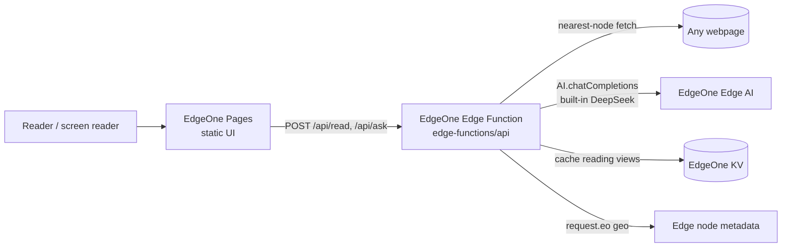

# ◐ Lumen — the web, readable for everyone

**Live app:** https://lumen.edgeone.cool · **Built for the Agent Forge Mini Hackathon** (AI Builders × Tencent EdgeOne Makers, AI Engineer World's Fair SF)

**Submission:** [🎬 90-second demo video](docs/lumen-demo.mp4) · [📑 slide deck (PDF, 8 pages)](docs/lumen-deck.pdf) · [🌐 deployed on EdgeOne Makers](https://lumen.edgeone.cool)

Lumen is an **edge-native accessibility agent**. Paste any URL and it fetches the page at the Tencent EdgeOne node nearest to you, strips the clutter, and rebuilds it as a clean, plain-language reading view a screen reader can actually navigate — then answers questions about the page, following links on its own when it needs to.


## The problem

The WebAIM Million study finds accessibility failures on ~95% of top homepages — missing alt text, broken heading structure, unlabeled controls, walls of clutter. For the 285M+ people worldwide with visual impairment (and everyone with a cognitive or reading disability), most of the web is exhausting or unusable. Overlay widgets patch the symptoms on sites that opt in; nothing helps the *reader* on the sites that don't.

Lumen flips the model: instead of waiting for every website to fix itself, it gives the reader an agent that repairs any page on demand.

## What it does

1. **Reads any page** — fetches the URL from the nearest of EdgeOne's 3,200+ edge nodes, extracts real content, headings and links.
2. **Rebuilds it for humans** — EdgeOne's built-in DeepSeek model rewrites the page into a summary, plain-language sections, a navigable page map, key actions, and flags accessibility traps it found.
3. **Answers questions like an agent** — "Where do I sign up?", "What does this cost?" It can decide to open a link from the page (a visible tool call) to find the answer, then reports what it did.
4. **Practices what it preaches** — the UI itself is WCAG-minded: semantic landmarks, aria-live announcements, keyboard shortcuts, high-contrast mode, adjustable type, built-in text-to-speech.

## Architecture — 100% on EdgeOne Makers



No origin server, no API keys, no cold starts: the entire product is static assets plus one edge function.

| EdgeOne Makers product | How Lumen uses it |
|---|---|
| **Pages hosting** | Serves the accessible UI globally with CDN acceleration |
| **Edge Functions** | Runs the whole agent: fetch → extract → rewrite → answer |
| **Edge AI (built-in DeepSeek)** | Page rewriting and agentic Q&A via the `AI.chatCompletions` global — zero keys, with automatic fallback across `deepseek-v4 → v32 → v3-0324` |
| **KV storage** | Caches rebuilt pages (24h TTL) so any repeat reader worldwide gets an instant response *(pending account approval; code degrades gracefully)* |
| **Geo metadata (`request.eo`)** | Shows which edge node served you — the latency story, visible in the footer |
| **EdgeOne CLI + API token** | Headless CI-style deploys (`edgeone pages deploy`) |

### Why the edge matters here

- **Latency is accessibility.** Screen-reader users hear pages serially; every second of waiting costs more than it does for sighted users. Nearest-node fetching + KV caching keep Lumen fast everywhere.
- **Shared memory.** One reader's rebuilt page becomes every reader's instant page — a global, communal cache of accessible views.
- **Zero infrastructure.** The built-in model gateway means no backend, no keys to leak, nothing to scale.

## Run it yourself

```bash
npm i -g edgeone
edgeone login -s global -t <your EdgeOne Pages API token>
edgeone pages deploy . -n <project-name>
```

That's the entire pipeline — the repo deploys as-is. (Optionally bind a KV namespace named `lumen_kv` in the Makers console to enable the shared cache.)

## API

| Endpoint | Body | Returns |
|---|---|---|
| `POST /api/read` | `{ "url": "https://…" }` | `{ title, headings[], view: { summary, sections[], keyActions[], warnings[] } }` |
| `POST /api/ask` | `{ "url", "question", "history[] }` | `{ answer, steps[] }` — `steps` lists any links the agent opened |
| `GET /api/health` | — | Edge node geo, model list, KV status |

## Project structure

```
index.html                      accessible UI (no build step, loads instantly)
assets/style.css                flat, AAA-contrast design system
assets/app.js                   reading view, Q&A thread, TTS, shortcuts
edge-functions/api/[[default]].js  the agent: fetch, extract, rewrite, answer, cache
```

## Honest limitations

- Free built-in models have daily quotas; Lumen rotates across three DeepSeek variants and reports clearly when exhausted.
- Sites that block server-side fetching (aggressive bot walls) can't be rebuilt; Lumen says so instead of hallucinating.
- Heavy client-side-rendered apps expose less static content to rebuild.

## Team

Pranav Achar — [github.com/PranavAchar01](https://github.com/PranavAchar01). Lumen continues the accessibility thread of my earlier work (Pathfinder, an edge-first web navigation aid for blind users).

MIT licensed.
