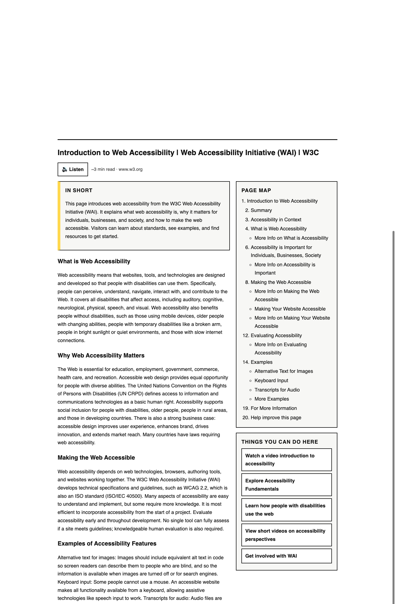
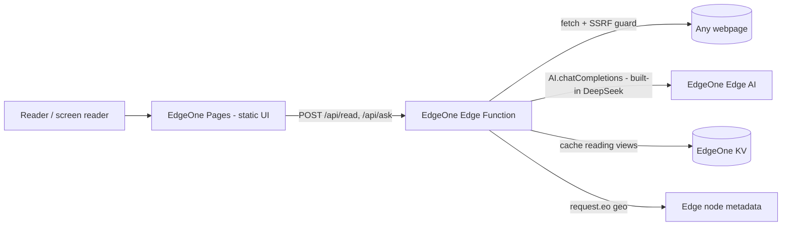

# ◐ Lumen — the web, readable for everyone
s
> 🏆 **Top 5 — Agent Forge Mini Hackathon** (AI Builders × Tencent EdgeOne Makers, AI Engineer World's Fair SF)

**Live app:** https://lumen.edgeone.cool · **Built for the Agent Forge Mini Hackathon** (AI Builders × Tencent EdgeOne Makers, AI Engineer World's Fair SF)

**Submission:** [🎬 demo video](docs/lumen-demo.mp4) ([transcript](docs/VIDEO-TRANSCRIPT.md)) · [📑 slide deck (PDF, 8 pages)](docs/lumen-deck.pdf) · [🌐 deployed on EdgeOne Makers](https://lumen.edgeone.cool)

Lumen is an accessibility agent that runs inside a Tencent EdgeOne edge function. You give it a URL; it fetches the page, extracts the real content, and uses EdgeOne's built-in LLM to rebuild the page as a plain-language reading view for screen-reader, low-vision, and cognitive-disability users. It can then answer questions about the page, opening links from the page as a tool when the answer isn't on the current page.



## The problem

The [WebAIM Million](https://webaim.org/projects/million/) study (Feb 2024, automated scan of the top 1,000,000 home pages) detected WCAG failures on **95.9%** of them — averaging ~57 errors per page: missing alt text, empty links, missing form labels, low contrast. Roughly [285 million people worldwide](https://www.who.int/news-room/fact-sheets/detail/blindness-and-visual-impairment) live with visual impairment, and many more have cognitive or reading disabilities. Accessibility-overlay products only affect sites that install them; they do nothing for a reader visiting a site that hasn't.

Lumen's approach is to fix the page for the reader at request time, on any site, rather than waiting for each site to fix itself.

## What it does

1. **Reads any page** — fetches the URL from an EdgeOne edge node and extracts content, headings, and links.
2. **Rebuilds it** — EdgeOne's built-in DeepSeek model produces a summary, plain-language sections, a page map, key actions, and any accessibility warnings it spots.
3. **Answers questions** — for a question it can't answer from the current page, the agent may open a link that appears on the page (up to 3 hops), and it reports each link it opened.
4. **Is itself accessible** — semantic landmarks, `aria-live` status, keyboard shortcuts, high-contrast mode, adjustable text size, and browser text-to-speech.

## Architecture — runs entirely on EdgeOne Makers



The whole product is static assets plus one edge function — no origin server and no API keys.

| EdgeOne Makers product | How Lumen uses it |
|---|---|
| **Pages hosting** | Serves the static UI on EdgeOne's global network |
| **Edge Functions** | Runs the whole agent: fetch → extract → rewrite → answer |
| **Edge AI (built-in DeepSeek)** | Rewriting and Q&A via the `AI.chatCompletions` global — no key; falls back across `deepseek-v4 → v32 → v3-0324` |
| **KV storage** | Caches reading views (24h TTL) so a repeat request is served without re-running the model. **Optional:** the app runs without it and reports its status at `/api/health` (`"kv": true/false`) |
| **Geo metadata (`request.eo`)** | Reports which node served the request; shown in the footer and at `/api/health` |
| **EdgeOne CLI + API token** | Headless deploys (`edgeone pages deploy`) |

EdgeOne states its network spans [3,200+ edge nodes](https://edgeone.ai/); Lumen relies on that network for the fetch and for hosting rather than measuring it itself.

### Verify it works (about 60 seconds)

```bash
# 1. Health + which edge node served you + whether KV is enabled
curl -s https://lumen.edgeone.cool/api/health | jq

# 2. Rebuild a page (returns the structured reading view)
curl -s -X POST https://lumen.edgeone.cool/api/read \
  -H 'content-type: application/json' \
  -d '{"url":"https://en.wikipedia.org/wiki/Screen_reader"}' | jq '.view.summary, .view.sections[0].heading'

# 3. Ask a question about that page
curl -s -X POST https://lumen.edgeone.cool/api/ask \
  -H 'content-type: application/json' \
  -d '{"url":"https://en.wikipedia.org/wiki/Screen_reader","question":"What are the main types of screen reader?"}' | jq '.answer, .steps'

# 4. Confirm the SSRF guard rejects internal targets (expect an error, HTTP 400)
curl -s -X POST https://lumen.edgeone.cool/api/read \
  -H 'content-type: application/json' \
  -d '{"url":"http://169.254.169.254/latest/meta-data/"}'
```

## Security

Because the edge function fetches user-supplied URLs, it is guarded against server-side request forgery (SSRF):

- Only `http`/`https`, no embedded credentials, and a small port allow-list.
- Requests to loopback, private (`10/8`, `172.16/12`, `192.168/16`, `100.64/10`), link-local **including the `169.254.169.254` cloud-metadata address**, multicast/reserved ranges, and IPv6 loopback/ULA/link-local are rejected — as are `localhost`, `*.local`, `*.internal`, `metadata.google.internal`, and numeric/hex IP encodings.
- Redirects are followed **manually and each hop is re-validated**, so a public URL cannot redirect into an internal one.
- Known limitation: the edge runtime doesn't expose a DNS resolver, so this does not by itself prevent DNS-rebinding (a hostname that resolves to a public address on check and a private one on fetch). Mitigating that needs address pinning at the platform layer.

The guard is covered by unit tests (`test/lumen.test.mjs`).

## Tests

Pure logic (SSRF guard, HTML extraction, model-output parsing) is unit-tested with the Node test runner — no dependencies, and it runs in CI on every push (`.github/workflows/ci.yml`):

```bash
npm test   # node --test
```

## Run it yourself

```bash
npm i -g edgeone
edgeone login -s global -t <your EdgeOne Pages API token>
edgeone pages deploy . -n <project-name>
```

Optionally bind a KV namespace named `lumen_kv` in the Makers console to enable the cache.

## API

| Endpoint | Body | Returns |
|---|---|---|
| `POST /api/read` | `{ "url": "https://…" }` | `{ url, title, lang, headings[], view: { summary, readingTimeMin, sections[], keyActions[], warnings[] } }` |
| `POST /api/ask` | `{ "url", "question", "history"[] }` | `{ answer, steps[] }` — `steps` lists the links the agent opened |
| `GET /api/health` | — | `{ node, models[], kv, time }` |

Invalid or blocked URLs return `{ "error": "…" }` with HTTP 400.

## Project structure

```
index.html                         accessible UI (no build step)
assets/style.css                   flat, high-contrast styles
assets/app.js                      reading view, Q&A thread, TTS, shortcuts
edge-functions/api/[[default]].js  the agent: SSRF-guarded fetch, extract, rewrite, answer, cache
test/lumen.test.mjs                unit tests for the pure helpers
.github/workflows/ci.yml           runs the tests on every push
```

## Limitations

- **HTML extraction is a regex-based heuristic, not a DOM parser.** Edge functions have a ~200ms CPU budget and no DOM, so extraction favours resilience (it never throws on malformed markup) over perfect fidelity on deeply nested pages. Tested against malformed input; see `test/`.
- **Heavy client-rendered apps** expose little static HTML, so there's less for Lumen to rebuild.
- **Free built-in models have daily quotas.** Lumen rotates across three DeepSeek variants and reports clearly when they're exhausted.
- **Sites with aggressive bot protection** may refuse the server-side fetch; Lumen returns the error rather than inventing content.

## Team

Pranav Achar — [github.com/PranavAchar01](https://github.com/PranavAchar01). Related earlier work: Pathfinder, an edge-first web navigation aid for blind users.

MIT licensed.
